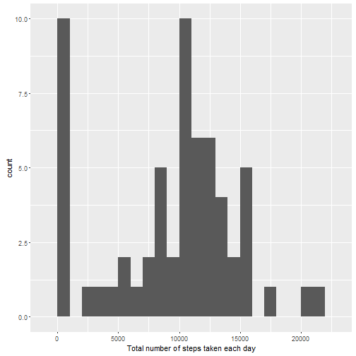
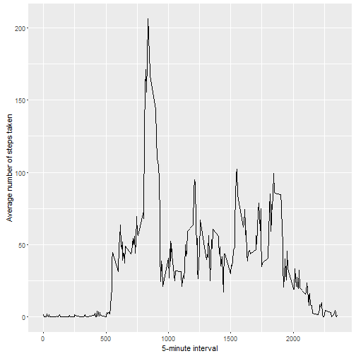
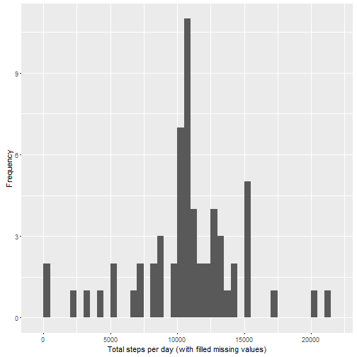
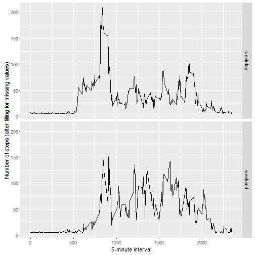

# Reproducible Data Analysis - Peer Assessment


```r
require(ggplot2)
```

```
## Loading required package: ggplot2
```

```r
require(Hmisc)
```

```
## Loading required package: Hmisc
```

```
## Warning: package 'Hmisc' was built under R version 3.2.4
```

```
## Loading required package: lattice
```

```
## Loading required package: survival
```

```
## Loading required package: Formula
```

```
## 
## Attaching package: 'Hmisc'
```

```
## The following objects are masked from 'package:base':
## 
##     format.pval, round.POSIXt, trunc.POSIXt, units
```

## Load unzipped csv file from the working directory

```r
if(!exists("activity")){
    activity <- read.csv("activity.csv",header=TRUE, sep=",")
}
```

##  Determining mean total number of steps taken per day

```r
stepsTakenEveryDay <- tapply(activity$steps, activity$date,sum, na.rm=T)
```

## Histogram of the total number of steps taken each day

```r
qplot(stepsTakenEveryDay, binwidth=1000, xlab="Total number of steps taken each day")
```



## Mean and Median total number of steps taken per day

```r
meanStepsTakenEachDay <- mean(stepsTakenEveryDay)
medianStepsTakenEachDay <- median(stepsTakenEveryDay)
```

## Get average number of steps per 5 minutes interval

```r
meanStepsPerTimeInterval <- aggregate(steps ~ interval, activity, FUN = mean, na.rm=TRUE)
```

# Time-Series Plot

```r
ggplot(data=meanStepsPerTimeInterval, aes(x=interval, y=steps)) +
    geom_line() +
    xlab("5-minute interval") +
    ylab("Average number of steps taken") 
```



## 5-minute interval, from all the days in the dataset, contains the maximum average number of steps?

```r
mostStepsInterval <- which.max(meanStepsPerTimeInterval$steps)
intervalMostSteps <-  gsub("([0-9]{1,2})([0-9]{2})", "\\1:\\2", meanStepsPerTimeInterval[mostStepsInterval,'interval'])
```

## Report the total number of missing values in the dataset
numNA <- sum(is.na(activity$steps))

## Creating a new dataset that is equal to the original dataset but with the missing data filled in
## using the "Hmisc" package to "impute" missing values (insert means from the sample)

```r
activityFilled <- activity
activityFilled$steps <- impute(activity$steps, fun=mean)
```

## Histogram of the total number of steps taken each day

```r
stepsTakenEveryDayFilled <- tapply(activityFilled$steps, activityFilled$date, sum)
qplot(stepsTakenEveryDayFilled, xlab='Total steps per day (with filled missing values)', ylab='Frequency', binwidth=500)
```



## Calculate and report the mean and median total number of steps taken per day

```r
meanStepsTakenEachDayFilled <- mean(stepsTakenEveryDayFilled)
meanStepsTakenEachDayFilled <- median(stepsTakenEveryDayFilled)
```

## Creating a new variable with two levels - "weekday" and "weekend" indicating whether a given date is a weekday or weekend day.

```r
getDayType <- function(date) {
    day <- weekdays(date)
    if (day %in% c("Monday", "Tuesday", "Wednesday", "Thursday", "Friday"))
        return("weekday")
    else if (day %in% c("Saturday", "Sunday"))
        return("weekend")
    else
        stop("Not a valid date")
}

activityFilled$date <- as.Date(activityFilled$date)
activityFilled$dayType <- sapply(activityFilled$date, FUN=getDayType)
```

## Making a time series plot showing weekday and weekend pattern


```r
meanFilledStepsPerTimeInterval <- aggregate(steps ~ interval + dayType, activityFilled, mean)
ggplot(meanFilledStepsPerTimeInterval, aes(interval, steps)) + geom_line() + facet_grid(dayType ~ .) +
    xlab("5-minute interval") + ylab("Number of steps (after filling for missing values)")
```



